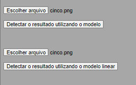
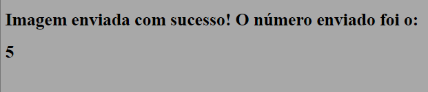

# Ponderada Semana 10 - Luiz Fernando Leão

## Objetivo

&emsp;O objetivo da atividade é usar redes neurais convolucionais para criar um modelo que detecte algarismos numéricos escritos manualmente, e configurar duas rotas no backend para receber uma imagem de um algarismo e retornar o valor do algarismo, e para exibir uma página HTML com um formulário para envio de uma imagem e que exiba o valor do algarismo encontrado.

## Instalação

&emsp;Para inicializar o projeto no computador, realize os seguintes passos:

1. Clone este repositório em sua máquina, abra o terminal e navegue até a pasta em que o repositório será clonado, e digite:

    ```console
    git clone https://github.com/LuizFernandoLeao/modulo6
    ``` 

2. Navegue até onde a pasta foi criada e digite o seguinte comando para acessar a pasta raíz do workspace:

    ```console
    cd pond_sem_10/src
    ``` 
3. Crie o ambiente virtual

   ```console
    python -m venv .
    cd Scripts
    activate
    cd ..
    ``` 

4. Agora é preciso apenas rodar o código, com o comando:

    ```console
    python main.py
    ``` 

## Demonstração

&emsp;Para demonstrar o funcionamento da atividade, segue os prints que demonstram o sistema.



