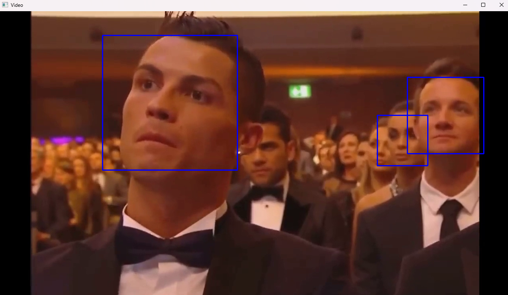

# Prova 1 - Luiz Fernando Leão

## Objetivo

&emsp;O objetivo da atividade é criar um sistema de detecção de rostos, que identifique as faces em primeiro plano de um vídeo

## Respostas

### 2.1

&emsp;O método de detecção escolhido foi o HAAR Cascade. Ele é capaz de identificar objetos em imagens e vídeos, como as faces humanas presentes no vídeo desta atividade. Este método é considerado rápido e preciso para fazer essas identificações. A partir do arquivo haarcascade_frontalface_default.xml, um classificador pré-treinado a partir da detecção de rostos humanos, é possível implementar um sistema que detecte faces humanas no vídeo.

### 2.2

&emsp;Em termos de viabilidade técnica, facilidade de implementação e versatilidade da solução, considero que a melhor alternativa seja o HAAR Cascade, pois este método é conhecido por ser rápido e preciso, e funciona suficiente bem para detectar faces humanas, o que diminui a necessidade de implementar métodos mais complexos.

&emsp;A segunda alternativa é a CNN (Rede Neural Convolucional). Ela é altamente utilizada e aplicada em imagens, pois possuem cadas convolucionais conectadas, que são capazes de extrair características das imagens. Por ser considerada um tipo de rede neural profunda, ela possui uma dificuldade de implementação maior do que o HAAR Cascade, o que fez ela ser a segunda alternativa.

&emsp;A próxima alternativa, o NN Linear, pode ser uma boa opção para detectar rostos humanos. Ele é um módulo fornecido pelo PyTorch, que aplica uma transformação linear nos dados de entrada a partir de cálculos matemáticos. Apesar de não ser mais difícil de implementar em relação as outras alternativas, ela ainda sim é inferior ao HAAR Cascade e ao CNN em termos de viabilidade técnica.

&emsp;Por último, a alternativa é os Filtros de correlação cruzada. A Convolução em Deep Learning é considerada uma correlação cruzada. Assim, este método é capaz de, por exemplo, numa imagem, juntar uma determinada quantidade de pixels para originar novos pixels em novas imagens. Apesar dessas características, a detecção de rostos desta alternativa é inferior ao HAAR Cascade e ao CNN, devido a sua viabilidade técnica.

### 2.3

&emsp;Por se tratar de detalhes mais avançados sobre detecção de faces, a detecção de emoções faciais humanas deve ser mais apropriada para ser implementada utilizando métodos mais sofisticados, como o CNN, em primeiro lugar, e NN Linear em seguindo, pois são capazes de fazer detecções mais precisas, e num caso em que a detecção possui detalhes mais avançados, pode ser mais benéfico optar por métodos mais robustos, que podem não ser rápidos e eficientes, mas apresentam respostas precisas. 

&emsp;A terceira alternativa é o HAAR Cascade, pois com um bom classificador pré-treinado, ela pode ser uma boa opção, e por último, os filtros de correlação cruzada

### 2.4

&emsp;A solução apresentada não possui a capacidade de considerar variações de um frame para outros, pois a solução é treinada previamente, e quando esta no processo de identificações de rostos humanos, ela faz a análise entre os frames e retorna os resultados, mas sem considerar o que ocorreu em frames anteriores. 

&emsp;Para que isso seja possível, é preciso configurar a solução para ser capaz considerar os frames anteriores para fazer novas detecções durante o processo de análise das expressões faciais de humanos num vídeo, por exemplo. Assim, deve-se utilizar modelos robustos no contexto das redes neurais, como por exemplo os MLPs (Multi-layer perceptrons), para que seja possível fazer uma solução em que os frames anteriores interferem no resultados dos frames seguintes

### 2.5

&emsp; Vini Jr deve ganhar a bola de ouro, mas vai depender ainda do resultado da Copa América. E se o Bellingham ganhar a Euro ferrou pro Vini.

## Instalação

&emsp;Para inicializar o projeto no computador, realize os seguintes passos:

1. Clone este repositório em sua máquina, abra o terminal e navegue até a pasta em que o repositório será clonado, e digite:

    ```console
    git clone https://github.com/LuizFernandoLeao/modulo6
    ``` 

2. Navegue até onde a pasta foi criada e digite o seguinte comando para acessar a pasta raíz do workspace:

    ```console
    cd prova_sem_9
    ``` 

3. Agora é preciso configurar o ambiente virtual, seguindo o seguinte comando:

   ```console
    python -m venv .
    cd Scripts
    activate
    cd ..
    ``` 

4. Execute o arquivo de detecção de rostos:

    ```console
    python haar.py
    ``` 

## Demonstração

&emsp;Para demonstrar o funcionamento do sistema de detecção de rostos, segue abaixo um print do momento em que rostos foram detectados no vídeo:



&emsp;Neste print, é possível ver um retângulo em torno dos rostos no vídeo, o que demonstra o funcionamento do sistema de detecção de faces