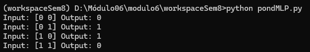

# Ponderada Semana 8 - Luiz Fernando Leão

## Objetivo

&emsp;O objetivo da atividade é implementar um MLP para resolver o problema do XOR. Na atividade, foi preciso treinar o perceptron e de modo que ele tenha uma camada escondida, com um processo de treinamento utilizando gradiente descendente. Após essa implementação, foi preciso validar o MLP criado treinando-o para funcionar como uma porta XOR.

## Instalação

&emsp;Para inicializar o projeto no computador, realize os seguintes passos:

1. Clone este repositório em sua máquina, abra o terminal e navegue até a pasta em que o repositório será clonado, e digite:

    ```console
    git clone https://github.com/LuizFernandoLeao/modulo6
    ``` 

2. Navegue até onde a pasta foi criada e digite o seguinte comando para acessar a pasta raíz do workspace:

    ```console
    cd workspaceSem8/src
    ``` 

3. Agora é preciso apenas rodar o código, com o comando:

   ```console
    python pondMLP.py
    ``` 

4. E para rodar o código com a utilização do Pytorch, utilize o seguinte comando:

    ```console
    python pondTorch.py
    ``` 

## Demonstração

&emsp;Para demonstrar o funcionamento da atividade, segue o print que demonstra o sistema.

